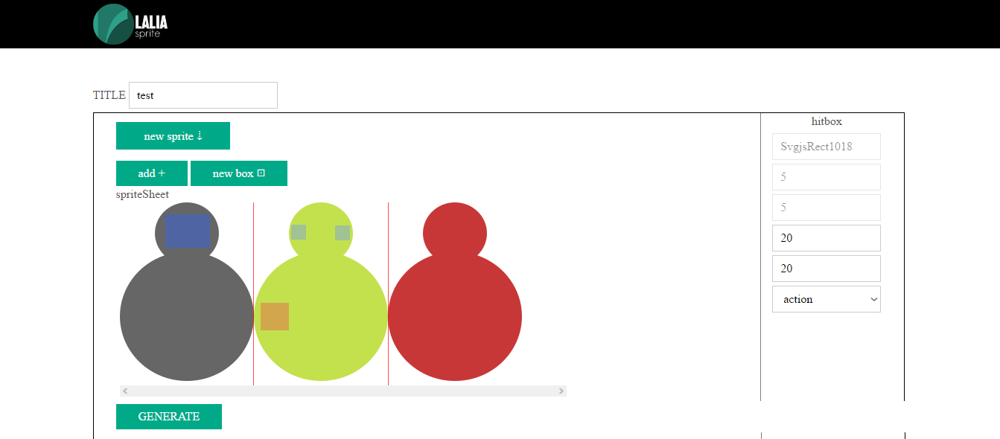

# LaliaSprite

<h4>Js spritesheet generator & hitboxes definer</h4>

Lalia sprite is a tool that you can easily (like a web site) run locally in order to generate your spritesheet
with different sprite sizes and define for each sprite the hit areas (or collide zone).

  Lalia sprite generate a .png file (the spritesheet) and a .json file (the spritesheet details and hitboxes details )

<h4>Preview</h4>

