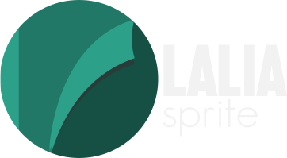

# Laliasprite v 2.0.0 
- (sprite atlases support)
 
* Laliasprite is a PhaserJS based tool-framework that helps you to generate hitboxes for your 2D game characters and setup interactions with them (when animation is playing for example)

<h4>Preview</h4>


  - Phaser JS
  - SVG.JS
  - some Magic

# New Features!

  - Support sprite atlases
  - Support sprite scaling

### Usage
 #### A. Download and test this example to see interactions.
 
 #### B. or FOLLOW THESE STEPS
 
 #### STEP 1. Run Locally (server) the project in **/tool** folder
  You can use wamp | xamp | mamp
  
  .Two files are generated : **yoursprite.png** (in /sprites folder) and **yoursprite.json** (in /json folder)
  
 #### STEP 2 . Create your new PhaserJS game project
 a. Write this in your **index.html**
 
```sh
    ...
    //Load phaser.js (first)
    <script src="js/phaser.js"></script>
    //Load laliasprite.js*/
    <script src="js/laliasprite-2.0.js"></script>
    
    //NB : in laliasprite.js ,comment "box.alpha = 0;" to see hitboxes
 
```
 b. In your **preload** function , do this
    
    
```sh
    //Create new Lalia instance
     Lalia = new Lalia();
     
    //Load sprite atlases or spritesheet
    //load atlases
     Lalia.atlas(game, "jogoy", 'img/jogoy_atlas.png', 'json/jogoy_atlas.json', 'json/jogoy_atlas_hitboxes.json' );
   
    //load sheet
    //Lalia.sheet(game, "jogoy", 'img/jogoy_sheet.png', 'json/sheet_hitboxes.json', 180, 240);
    
   
 
```

 c. In your **create** function , do this

```sh
    //Add sprite to game scene
    jogoysprite = game.add.sprite(100, 30, 'jogoy');
    ...
    //Add animation to sprite
    jogoysprite.animations.add("idle", ["1" ,"2", "3"],1, false);
        
    //Setting jogoysprite hitboxes for a specific animation (frames);
    Lalia.atlasboxes(jogoysprite, 'idle');
    //Lalia.sheetboxes(jogoysprite, 'idle');
    ...
    //Add other characters 
    hitter = game.add.sprite(130, 40, 'mario');
    ...
    //Set objects which will collide with our character (jogoysprite) hitboxes 
    jogoyColliders.push(hitter);
    ...
     
  
```


 d. **Create your action callback**

```sh
    //Do this when jogoysprite is touched at a certain point during "idle" animation
      function die()
      {
         //Kill jogoysprite
      }
    
```

 e. In your **update** function, do this :

```sh
   //On button taped or keyboard event
    jogoysprite.animations.playaction('idle','hit', jogoyColliders, die);
   ...
  
    
```


### Remarks

Laliasprite works better with non-minified version of Phaser

| Techs | links |
| ------ | ------ |
| PhaserJS | [https://phaser.io/]|
| SVGJS | [http://svgjs.com/] |
| DomToImg | [https://github.com/tsayen/dom-to-image] |
| PHP |  |
| some Magic :) | |


### Development

Want to contribute? Great!

Let's help to improve this tool-framework ! Just fork it.

#### Useful sample scenarios


### 


License
----

MIT License


** Made at [kayelsoft](www.kayelsoft.com) with some [**dakhaar**](https://en.wikipedia.org/wiki/Tamarind) , :) !
